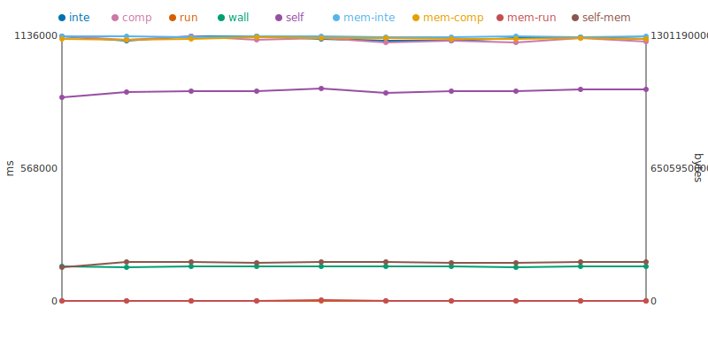

[[https://github.com/jtimon/til/raw/master/img/logo.svg]]

* Til

A programming language with ownership semantics, type inference, and compile-time
garbage collection. This is the second implementation attempt, written in C. The
first attempt in Rust lives at [[https://github.com/jtimon/rstil][rstil]].

* Dependencies

- ~make~
- ~gcc~
- ~xvfb~ (for GUI tests)

* Internal dependencies (bundled in the repository)

- [[https://github.com/libffi/libffi][libffi]]
- [[https://github.com/raysan5/raylib][raylib]]
- [[https://sourceforge.net/projects/tinyfiledialogs/][tinyfiledialogs]]

Bundled internal dependency licenses:

- project: [[file:LICENSE/TIL.txt]]
- ~lib/libffi/~ — [[file:LICENSE/libffi.txt]]
- ~lib/raylib/~ — [[file:LICENSE/raylib.txt]]
- ~lib/tinyfiledialogs/~ — [[file:LICENSE/tinyfiledialogs.txt]]

* Usage

** Build

~bin/til_boot~ is built entirely from the last commit (via git).
~bin/til~ is built from all current sources (.til and C). The
self-hosting bootstrap does not constrain commit structure.

#+begin_src sh
make
#+end_src

** Run

Interpret a program:
#+begin_src sh
bin/til interpret program.til
#+end_src

Compile to C and run:
#+begin_src sh
bin/til run program.til
#+end_src

** Test

#+begin_src sh
make test
#+end_src

* Performance

